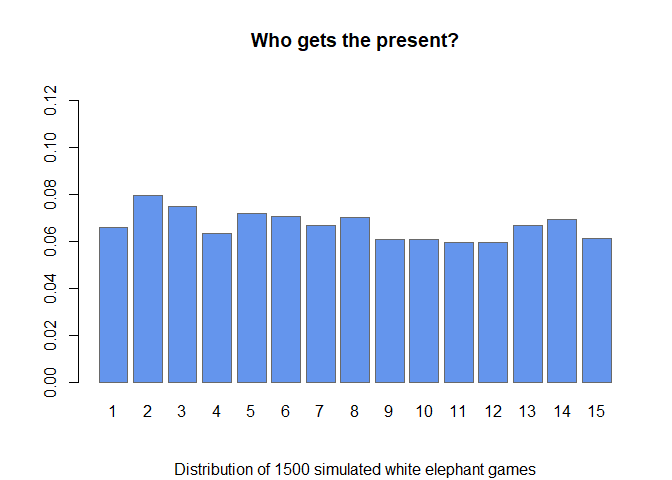

<!-- README.md is generated from README.Rmd. Please edit that file -->

# partyGames

<!-- badges: start -->
<!-- badges: end -->

The goal of partyGames is to simulate various party games and help you
devise a better strategy to win.

## Installation

You can install the development version of partyGames like so:

``` r
# install.package("devtools")
devtools::install_github("KPDuBose/partyGames")
```

## Example

Simulate 1500 White Elephant Games under different conditions.

``` r
library(partyGames)
games <- simulateElephant(15, dice = TRUE, coins = 1, iter = 1500, pheads = 0.5, sides = 6, numDice = 1)
summaryElephant(games)
#> $winner
#> winner
#>   1   2   3   4   5   6   7   8   9  10  11  12  13  14  15 
#>  98 102  98  98  91  88 101  97 112  85 108 100 106 100 116 
#> 
#> $moves
#> moves
#>   -6   -5   -4   -3   -2   -1    1    2    3    4    5    6 
#> 1850 1818 1925 1805 1896 1849 1890 1936 1823 1920 1935 1853 
#> 
#> attr(,"class")
#> [1] "elphSum" "list"
class(games)
#> [1] "elphList" "list"
plotElephant(summaryElephant(games))
```


