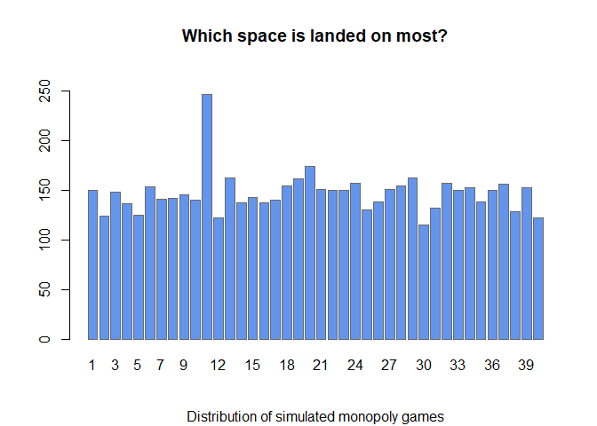
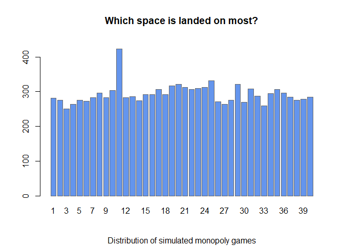

<!-- README.md is generated from README.Rmd. Please edit that file -->

# partyGames

<!-- badges: start -->

[](https://github.com/UofUEpiBio/partyGames/actions)
<!-- badges: end -->

The goal of partyGames is to simulate various party games and help you
devise a better strategy to win.

## Installation

You can install the development version of partyGames like so:

``` r
# install.package("devtools")
devtools::install_github("KPDuBose/partyGames")
```

## White Elephant Games

Simulate 1500 White Elephant Games under different conditions.

``` r
library(partyGames)
games <- simulateElephant(15, dice = TRUE, coins = 1, iter = 1500, pheads = 0.5, sides = 6, numDice = 1)
summary.partyGames(games)
#> $winner
#> winner
#>   1   2   3   4   5   6   7   8   9  10  11  12  13  14  15 
#>  99  89 106 110  97  98  93 107 102 100 111  97 102  75 114 
#> 
#> $moves
#> moves
#>   -6   -5   -4   -3   -2   -1    1    2    3    4    5    6 
#> 1962 1891 1880 1857 1879 1847 1856 1921 1786 1875 1870 1876 
#> 
#> attr(,"class")
#> [1] "elphSum" "list"
class(games)
#> [1] "elphList" "list"
plot.partyGames(games)
plot.partyGames(summary.partyGames(games))
```


## Monopoly Simulation

Additionally, you can simulate Monopoly games based on the 2008 US
version of the game.

``` r

library(partyGames)
monopolyGame <- simulateMonopoly()
monopolyGame
#> [[1]]
#>  [1] 10  8 13 16 12 17 13 11 15 23 22 12 12 14 19 11 11 18 20 17 10 14 16 12 20
#> [26] 14 11 19 13 15 13 13 19 16 14 12 17 11 14 17
#> 
#> [[2]]
#>  [1] 12  8 17 19 15 17 16 16 12 13 24 16 13 16 13 13 13 10 16 15 14 14 16 19  8
#> [26] 18 15 15 12 16 11 15 11 18 16 13 16 14 19 11
#> 
#> [[3]]
#>  [1] 14 17 11 13 13 16 12 19 16 14 19 10 14 12  9 17 15 12 19 13 12 12 17 20 11
#> [26]  5 18 15 17 13 17 13 12 16 13 11 15 21  7 11
#> 
#> [[4]]
#>  [1] 17 13 12 15 15  9 14 15 17 14 28 12 13 19 14 13 21 21 14  6 12 21 16 22 18
#> [26] 13  8 12 11 12 12 17 20 13 15 16  8 19 13 16
#> 
#> [[5]]
#>  [1] 15 16 13 11 12 16  7 18 18 15 25 10 17 13 15 17 14 21  9 14 17 19 10 15 21
#> [26] 14 13 13 15 14 10 20 12 17 16 14 20 13 14 10
#> 
#> [[6]]
#>  [1] 12 16 17 12 12 14  7 19 11 18 22 16 13 15 14 18 13 13 11 13 14 16 15 12 19
#> [26] 15 15 10 12 15 11 18 10 15 23 10 11 18 15 13
#> 
#> [[7]]
#>  [1] 18 14 14 16 18 15  5 15 14 17 19 17 13 19 10 21  8 12 13 15 21 15 25 11 14
#> [26] 14 10 17 15  9 14 14 15 18 10 17 11 14 15 13
#> 
#> [[8]]
#>  [1] 21 11 11 13 11 17 13 17  8 21 16 22 14  7 16 14 16 13 15 15 19 12 18  9 18
#> [26] 17 14 14 11 11 15 22  9 20 13  8 13 11 13 20
#> 
#> [[9]]
#>  [1] 19 15  8 12 11 11 19 16 14 14 21 16 14  7 14 15 10 18 13 14 21 19 10 14 17
#> [26]  8 15  6 19 17 18 15 11 20 17 13 18 16 21  8
#> 
#> [[10]]
#>  [1] 13 13 15 20 11 11  9 13 10 22 18 17 14 13 13 16 13 16 21 17 16 14 16  9 14
#> [26] 16 13 16 17 13 12  7 18 11 12 19 15 18 10  9
#> 
#> attr(,"class")
#> [1] "monopoly" "list"
summary.monopoly(monopolyGame)
#>   1   2   3   4   5   6   7   8   9  10  11  12  13  14  15  16  17  18  19  20 
#> 151 131 131 147 130 143 115 159 135 171 214 148 137 135 137 155 134 154 151 139 
#>  21  22  23  24  25  26  27  28  29  30  31  32  33  34  35  36  37  38  39  40 
#> 156 156 159 143 160 134 132 137 142 135 133 154 137 164 149 133 144 155 141 128 
#> attr(,"class")
#> [1] "monoSum" "numeric"
plot.monopoly(monopolyGame)
```



Parallel computing (made possible in this case through Open MP) is also
possible for this.

``` r
monoParallel <- simulateMonopoly(numGames = 20, 
                                 maxTurns = 500, 
                                 sides    = 6, 
                                 numDice  = 2, 
                                 cores    = 3)

summary.monopoly(monoParallel)
#>   1   2   3   4   5   6   7   8   9  10  11  12  13  14  15  16  17  18  19  20 
#> 263 291 279 273 254 300 297 279 287 275 428 274 265 298 280 278 295 297 332 296 
#>  21  22  23  24  25  26  27  28  29  30  31  32  33  34  35  36  37  38  39  40 
#> 343 312 299 283 302 285 268 320 299 266 293 282 247 301 312 296 278 304 274 280 
#> attr(,"class")
#> [1] "monoSum" "numeric"
plot.monopoly(monoParallel)
```


