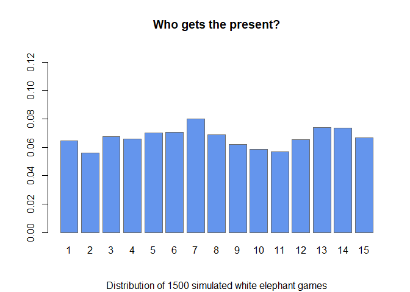

<!-- README.md is generated from README.Rmd. Please edit that file -->

# partyGames

<!-- badges: start -->

[](https://github.com/UofUEpiBio/partyGames/actions)
<!-- badges: end -->

The goal of partyGames is to simulate various party games and help you
devise a better strategy to win.

## Installation

You can install the development version of partyGames like so:

``` r
# install.package("devtools")
devtools::install_github("KPDuBose/partyGames")
```

## White Elephant Games

Simulate 1500 White Elephant Games under different conditions.

``` r
library(partyGames)
games <- simulateElephant(15, dice = TRUE, coins = 1, iter = 1500, pheads = 0.5, sides = 6, numDice = 1)
summary.partyGames(games)
#> $winner
#> winner
#>   1   2   3   4   5   6   7   8   9  10  11  12  13  14  15 
#> 111 104  83 100  92 104 117 102  97  91 105  99 104  81 110 
#> 
#> $moves
#> moves
#>   -6   -5   -4   -3   -2   -1    1    2    3    4    5    6 
#> 1885 1879 1870 1845 1938 1859 1943 1870 1855 1843 1854 1859 
#> 
#> attr(,"class")
#> [1] "elphSum" "list"
class(games)
#> [1] "elphList" "list"
plot.partyGames(games)
plot.partyGames(summary.partyGames(games))
```



## Monopoly Simulation

Additionally, you can simulate Monopoly games based on the 2008 US
version of the game.

Note: We are attempting to integrate OpenMP into the code to facilitate
parallelization of the code and allow faster responses times for the
simulation. This is not consistent yet and we recomend that users do not
attempt to parallelize the code yet.

``` r

library(partyGames)
monopolyGame <- simulateMonopoly()
monopolyGame
#> [[1]]
#>  [1] 14  9 11 12 11 20 14 17 14  9 22 13 16 17 12 19 17 14 17 14 16 18 14 14 18
#> [26] 16 15 15 12 13 14 13 16 20 13 12 16 12 14 16
#> 
#> [[2]]
#>  [1] 18 14 13  9 12 21  9 21 15 14 18 10 16 19 11 13 15 14 15 16 17 15 11 13 13
#> [26] 14 14 13 10 17 17 14 24 18  8 14 12 10 14 13
#> 
#> [[3]]
#>  [1] 12 19  9 17 16  9 19  8 16 15 21 13 17 14 15 17 14 16 13 20 22 14 14 11 16
#> [26] 12 19 18 16 17 10 15 16 10 19 21 11 17 16  9
#> 
#> [[4]]
#>  [1] 17 16 16 14  9 15 12 17 15 10 27 11 20 13 11 13 18 15 13 18 14 15 16 19 14
#> [26] 15 12 12 14 16 13  9 18 16 13 21 10  8 12 13
#> 
#> [[5]]
#>  [1] 10 17  7 13 22 15 15 11 17 21 23 20 18 12 10 12 16 16 14 24 18 14 14 19 12
#> [26] 13 15 22  7 16 11 15  9 14 14 15 20 17 18 12
#> 
#> [[6]]
#>  [1] 10 15  9 16 15 15 15  9 14 15 24 12 13 13 14 19 12 16 16 16 16 20  8 12 18
#> [26] 15 14 15 12 16 10 13 14 14 17 14 13 15 18  8
#> 
#> [[7]]
#>  [1] 15 14 14 15 10 10 18 21 14 11 19 10  9 16 13 17 17 13 12 12 19 12 15 12 21
#> [26] 14 17 14 12 16 13 11 20 20  9 18 11 16 18 11
#> 
#> [[8]]
#>  [1] 13 10 14  8 15 15 21 16  8 14 21 14 13 14 12 22  8 16 13 19 16 14 15 16 13
#> [26] 15 20 18 12 13 11 13 21  9 11 14 22 23 13 12
#> 
#> [[9]]
#>  [1] 11 17 23 10 12 16  8 12 23 14 20 12 20 16 14 14 16 11 10 24 12 16 19 17 13
#> [26] 27 13 12 14  9 15 18 13 16 18 13 12 25 10  9
#> 
#> [[10]]
#>  [1] 10 16  8 12 15 11  6 13 13 21 34 15 11  8 14 15 19 21 12 19 11 12 19 11 15
#> [26] 14 20 25 16 13  8 10 22 14 10 18 16 15 18 11
#> 
#> attr(,"class")
#> [1] "monopoly" "list"
summary.monopoly(monopolyGame)
#>   1   2   3   4   5   6   7   8   9  10  11  12  13  14  15  16  17  18  19  20 
#> 130 147 124 126 137 147 137 145 149 144 229 130 153 142 126 161 152 152 135 182 
#>  21  22  23  24  25  26  27  28  29  30  31  32  33  34  35  36  37  38  39  40 
#> 161 150 145 144 153 155 159 164 125 146 122 131 173 151 132 160 143 158 151 114 
#> attr(,"class")
#> [1] "monoSum" "numeric"
plot.monopoly(monopolyGame)
```


